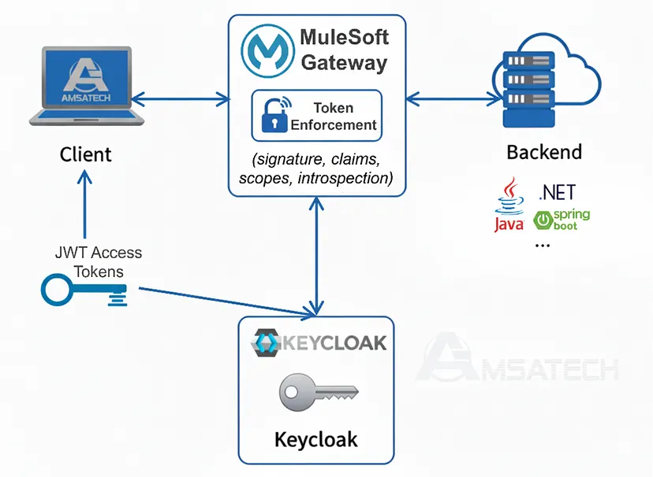

# 🔐 MuleSoft + Keycloak Integration POC  
**Secure API access with OAuth2 / JWT**  
_By Amsata Mbengue (AmsaTech)_

---

## 🧭 Overview

This Proof of Concept (POC) demonstrates how to secure ANY API using **Keycloak** as an OpenID Connect Identity Provider (IdP).  
It illustrates the full **OAuth2 Password Grant flow**, the **JWT validation**, and the way a **MuleSoft proxy or Flex Gateway** can validate tokens in real time.

The project is organized for clarity and portability — with scripts, Postman requests, and architecture documentation.

---

## ⚙️ Architecture Summary



1. **Client** authenticates to **Keycloak** and receives a JWT access token.  
2. **MuleSoft API Gateway / Proxy** receives the request with the token.  
3. The token is validated against **Keycloak’s JWKS endpoint**.  
4. If valid → access granted to the backend.  
5. If invalid → `401 Unauthorized`.

---

## 🚀 Quick Start
You can run the full Postman collection directly in your workspace:

[![Run in Postman]([](https://app.getpostman.com/run-collection/39062258-19507541-b7ba-4bc8-a753-72e1cbcf00d6?action=collection%2Ffork&source=rip_markdown&collection-url=entityId%3D39062258-19507541-b7ba-4bc8-a753-72e1cbcf00d6%26entityType%3Dcollection%26workspaceId%3D5e2235ad-6812-490d-a69d-87b37750e8a2#?env%5Bkeycloak-mule-poc%5D=W3sia2V5IjoiZ3JhbnRfdHlwZSIsInZhbHVlIjoiIiwiZW5hYmxlZCI6dHJ1ZSwidHlwZSI6ImRlZmF1bHQifSx7ImtleSI6InVzZXJuYW1lIiwidmFsdWUiOiIiLCJlbmFibGVkIjp0cnVlLCJ0eXBlIjoiZGVmYXVsdCJ9LHsia2V5IjoicGFzc3dvcmQiLCJ2YWx1ZSI6IiIsImVuYWJsZWQiOnRydWUsInR5cGUiOiJkZWZhdWx0In0seyJrZXkiOiJjbGllbnRfaWQiLCJ2YWx1ZSI6IiIsImVuYWJsZWQiOnRydWUsInR5cGUiOiJkZWZhdWx0In0seyJrZXkiOiJjbGllbnRfc2VjcmV0IiwidmFsdWUiOiIiLCJlbmFibGVkIjp0cnVlLCJ0eXBlIjoiZGVmYXVsdCJ9LHsia2V5IjoiYWNjZXNzX3Rva2VuIiwidmFsdWUiOiIiLCJlbmFibGVkIjp0cnVlLCJ0eXBlIjoiZGVmYXVsdCJ9LHsia2V5IjoicHJveHlfdXJpIiwidmFsdWUiOiIiLCJlbmFibGVkIjp0cnVlLCJ0eXBlIjoiZGVmYXVsdCJ9LHsia2V5Ijoia2NfYmFzZSIsInZhbHVlIjoiIiwiZW5hYmxlZCI6dHJ1ZSwidHlwZSI6ImRlZmF1bHQifSx7ImtleSI6InJlYWxtIiwidmFsdWUiOiIiLCJlbmFibGVkIjp0cnVlLCJ0eXBlIjoiZGVmYXVsdCJ9LHsia2V5IjoiIiwidmFsdWUiOiIiLCJlbmFibGVkIjp0cnVlLCJ0eXBlIjoiZGVmYXVsdCJ9XQ==))

Or clone the repository and run the scripts locally:

### 1️ Clone the repository
```bash
git clone https://github.com/amsatambengue/mulesoft-keycloak-poc.git
cd mulesoft-keycloak-poc
```

### 2️ Configure your environment

Create a .env file (not committed to GitHub) based on .env.example:
```bash

KC_BASE_URL=http://localhost:8080
REALM=mule_realm
CLIENT_ID=mule-gateway-client
CLIENT_SECRET=<YOUR_CLIENT_SECRET>
USERNAME=<YOUR_USERNAME>
PASSWORD=<YOUR_PASSWORD>
```

### 3 Run the token request
If you use Git Bash, Mac, or Linux:
```bash
chmod +x requests/get_token.sh
requests/get_token.sh
```
It returns a JSON object containing your access token.

💡 You can also use Postman instead of scripts.
Import both postman_collection.json and postman_environment.json.

### 4 🌐 Call the Secured API
Once you have your access token, update .env with:
```bash
ACCESS_TOKEN=<PASTE_ACCESS_TOKEN>
API_BASE_URL=https://<your-proxy-domain>/posts
```

Then execute:
```bash
chmod +x requests/call_secured_api.sh
requests/call_secured_api.sh
```

Expected output:
```json
{ "message": "Access granted. Token valid." }
```

👤 Author

Amsata Mbengue
Integration & DevOps Consultant — MuleSoft | API | Security | CI/CD | Kubernetes
📧 amsata.mbengue@gmail.com
